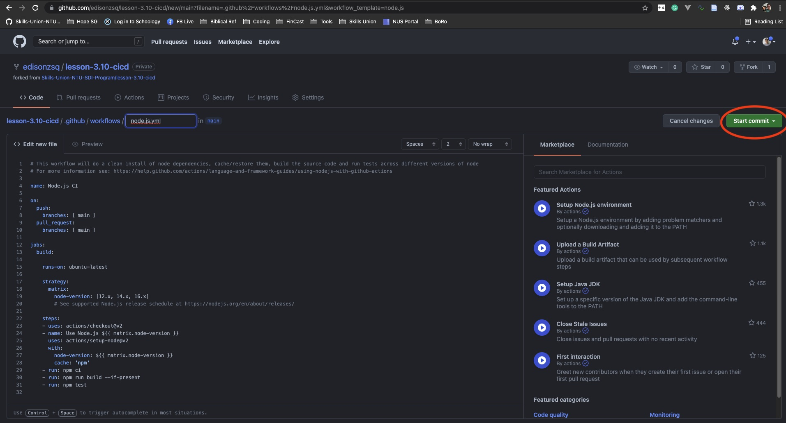

# Lesson 3.10 - CICD

## Brief

Please fork this repository then clone it before starting.

In this lesson, you will setup a Continuous Integration process with GitHub Actions. Continuous Delivery task is given as assignment. Follow the steps described here to create a GitHub Actions CI process.

Codebase is provided for you. 

### Part 1 - Installation & Observations

Change directory to the root folder and perform the following commands:
```
npm install
npm run test
```

Output:


### Part 2 - Create CI GitHub Actions

You should be able to access this repository in browser at `https://github.com/<your username>/lesson-3.10-cicd`. 

Step 1: Select -> Actions -> Node.js (circled in red).


Step 2: Click on "Start commit" button -> Click on "Commit new file".



You should see a new file `node.js.yml` being created. 

### Part 3 - Effect the CI Script by Making Any Changes

Step 1: Perform a `git pull` from your local directory. Actual command: `git pull origin main`. Make some changes to diff.txt (any changes), stage the file, commit it and push to the remote repository. See full commands here:

After making changes to `diff.txt`,
```
git add diff.txt
git commit -m "made changes"
git push origin main
```

Step 2: Go back to browser at URL: `https://github.com/<your username>/lesson-3.10-cicd`

Step 3: Click on "Actions" tab, and you will see the workflow being run. Wait for it to complete with a green tick. Then, click on it. Right now, you may browse around the jobs and observe what you seen on screen.


### Part 4 - Fail The Test

We shall cause the unit test to fail, and then observe the feedback of failed jobs on GitHub Actions.

Step 1: Replace `./src/strip-odd-number.test.js` with the following code:

```js
const target = require("./strip-odd-number");

it("should remove odd numbers", ()=>{
    const evenNumbers = target([1,2,3,4]);
    expect(evenNumbers).toEqual([]); // expect empty array will fail
})

```

Step 2: Perform GIT Push

Now, use these commands on Terminal to push code.

```
git add --all
git commit -m "intentionally failing the test"
git push origin main
```

Step 3: Observe the GitHub Actions Workflow


### Part 5 - Inspect `./github/workflows/node.js.yml` File

``` yml
name: Node.js CI

on:
  push:
    branches: [ main ]
  pull_request:
    branches: [ main ]

jobs:
  build:

    runs-on: ubuntu-latest

    strategy:
      matrix:
        node-version: [12.x, 14.x, 16.x]
        # See supported Node.js release schedule at https://nodejs.org/en/about/releases/

    steps:
    - uses: actions/checkout@v2
    - name: Use Node.js ${{ matrix.node-version }}
      uses: actions/setup-node@v2
      with:
        node-version: ${{ matrix.node-version }}
        cache: 'npm'
    - run: npm ci
    - run: npm run build --if-present
    - run: npm test
```

There are 3 parts to this workflow file.

1. The entire file is a workflow. The first segment is the name of the workflow is `Node.js CI`
2. The second segment is the event listeners:
    - When there is a push or pull request on `main` branch, this workflow will run.
    - This means that if you push another branches, this workflow will not start.
3. The third segment is the description of job(s).
    - It is possible to have multiple jobs. By default, jobs will run parallel unless you declare dependency with `if` and/or `needs` keyword.
    - In this file, there is only one job `build`.
    - The actions of this build:
        - spin off an instance of latest ubuntu os version
        - apply 3 versions of node.js to test the jobs
        - check out the repository
        - setup the code in repository with the 3 versions of node.js
        - run the commands: `npm ci`, `npm run build --if-present` and `npm test`


## End